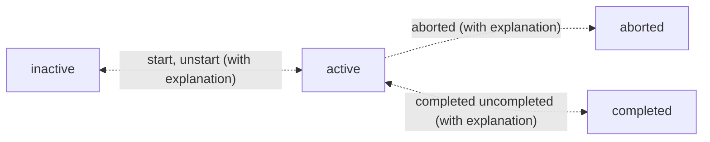

# Life Helper SolidJS Application

- [Life Helper SolidJS Application](#life-helper-solidjs-application)
  - [Notes](#notes)
  - [Basics](#basics)
  - [Vite Build and Preview](#vite-build-and-preview)
  - [Application Behavior](#application-behavior)
  - [Enable https self-signed SSL certificates:](#enable-https-self-signed-ssl-certificates)
  - [Service Workers:](#service-workers)
    - [Enable vite-plugin-pwa](#enable-vite-plugin-pwa)
    - [Enable caching using vite-plugin-pwa without PWA capabilities](#enable-caching-using-vite-plugin-pwa-without-pwa-capabilities)
  - [Login considerations](#login-considerations)
    - [Chrome bug with pattern attribute](#chrome-bug-with-pattern-attribute)
  - [Additional Software](#additional-software)
    - [Solid Drag and Drop Package](#solid-drag-and-drop-package)
  - [Enhancements:](#enhancements)
    - [Associate users with tasks](#associate-users-with-tasks)

## Notes

- Do not put an ampersand, `&`, in the name of a folder anywhere in the path within which `vite` is being used. It results in an error thrown by node.js saying that it cannot find vite. I did `NOT` try an uninstall and reinstall of `vite` to see if that may also be a solution.
- I think I used [this](https://redketchup.io/favicon-generator) site to create the icon.
- See [this](https://serviceworke.rs/) resource for all sorts of service worker implementations. Note that the UI design is a little weird and that the code associated with each of the `recipes` is accessible through the tiny links in the top right-hand corner. Also, if you click a code link that does not have code associated with it the interface does not inform you of that it just navigates to the page without the links which is really weird.
- I added `/** @jsxImportSource solid-js */` to the top of index.JSX, GlobalStateProvider.jsx and LifeHelperApp.jsx to get rid of the TypeScript errors in index.jsx. See [this](https://docs.solidjs.com/configuration/typescript) for more information.

## Basics

- To start this application run the following command.
  ```bash
  npm run dev
  ```
- This application uses the `Express Server` application as the backend for data access. The domain, that is the IP address and port, of this server is in `GlobalStateProvider.jsx` in this application. Whenever the Express Server is launched make sure that the domain IP address and port it is listening on are accurately reflected in GlobalStateProvider.jsx
- See the Documentation README for details.

## Vite Build and Preview

- In both cases I need to manually put a copy of service_worker.js in the dist directory.
- There should be some way to automate this.

## Application Behavior

- a task is `active` if it is started but not completed.
- a task is `inactive` if it is not `active, completed or aborted`.`
- A task cen be deleted only if it is not active, that is, has been started.
- A task can be aborted only if it has been started and not completed and the user provides an explanation.
- A task can be started but it can only be `un-started` if the task is not completed and if the user provides an explanation.
- A task can be can only be `un-completed` if the user provides an explanation.
- A task can be paused only if it has been started and not completed.



## Enable https self-signed SSL certificates:

- Service workers will only work with https.
- I used the plugin vite-plugin-mkcert to enable https in Vite which is running the front-end web server. That is, no actual certificate needs to be created as this plugin handles all of that.
- I used `mkcert to create root certificate authority certificates` for both the windows laptop and the linux laptop.
- See the Documentation README for details.

## Service Workers:

- Remember that if you go to the Application tab of Chrome Dev Tools you can see the service worker associated with that tab. You can also do things like `Stop` it and `Unregister` it.
- To reset the permissions for the service worker do the following:
  - Open the browser settings
  - Click on `Privacy and Security`
  - Click on `Site Settings`
  - Scroll to the appropriate URL, for example, https://127.0.0.1:3000 or https://localhost:3000 or both
  - Click the right-pointing triangle
  - Change Notifications from "Allow" to "Ask"
- You do not need to reset the permissions to release a new version of a service worker. You would only do this to test the web push subscription process.

### Enable vite-plugin-pwa

- I executed the following commands:
  ```
  npm install -D vite-plugin-pwa
  ```
- Then I added it to the vite config file vite.config.js
  ```
  import { VitePWA } from 'vite-plugin-pwa'
  ```
- Then I added it to the plugins node of the vite config file. I chose to experiment with the [Service Worker without PWA capabilities](https://vite-pwa-org.netlify.app/guide/service-worker-without-pwa-capabilities.html) first to I used the following configuration
  ```
  VitePWA({
    srcDir: "src",
    filename: "service_worker.js",
    strategies: "injectManifest",
    injectRegister: false,
    manifest: false,
    injectManifest: {
        injectionPoint: undefined,
    },
    devOptions: {
        enabled: true,
    },
  })
  ```

### Enable caching using vite-plugin-pwa without PWA capabilities

- The service worker is now selectively caching a few things in the service worker activation event. It is also aggressively caching everything in the fetch event that is not already cached and aggressively using cached items when available.

## Login considerations

### Chrome bug with pattern attribute

- See [this](https://issues.chromium.org/issues/40255414) for a deeper understanding. In an example in this discussion they change the pattern shown below to the pattern underneath it.
  ```
  pattern="^[a-zA-Z0-9!#$%&amp;'*+/=?^_`{|}~.-]+@[a-zA-Z0-9-]+(\.[a-zA-Z0-9-]+)\*$"
  pattern="^[a-zA-Z0-9!#$%&amp;'*+\/=?^_`\{\|\}~.\-]+@[a-zA-Z0-9\-]+(\.[a-zA-Z0-9\-]+)\*$"
  ```
- Here is a very simple example of this bug that I found. I use this pattern, to ensure that there is no white space in a input of type text; however, when viewed in chrome it appears as `pattern="^(?!.*s).+$"`, the backslash is missing. In order to fix this problem I had to make the following change.
  ```
  pattern="^(?!.*\s).+$"
  pattern="^(?!.*\\s).+$"
  ```
- `ODDLY ENOUGH THIS BUG DOES NOT OCCUR WHEN USING LIVE SERVER`

## Additional Software

### [Solid Drag and Drop Package](https://github.com/thisbeyond/solid-dnd/tree/main)

- I installed this package on 2/2/2025 to provide an elegant way to allow the user to sort lists using drag and drop in a SolidJS friendly way but, after about 5 hours, I realized that the repo had not been updated in

## Enhancements:

### Associate users with tasks

- Before I go any farther I need to know what gets stored in he database for authentication methods other than conventional user_name/password.
  - Continue with the tutorial.
- Backup the database before implementing these changes.
- Schema changes required to accomplish the following enhancements

  - Add the following columns to the task table
    - created_user
    - completed_user
    - deleted_user
  - Create the work_log table with the following columns
    - work_log_id auto-increment
    - user_identifier varchar(100)...we need to accommodate the pass key and other identifiers
    - task_id
    - started_work_dtm
    - ended_work_dtm
    - elapsed_time_in_minutes
  - Add foreign key relationships from task to user for
    - created_user
    - completed_user
    - deleted_user
    - remember to update p_add_all_foreign_keys
  - Add foreign key relationships from work_log to user for
    - user_name
  - Add foreign key relationships from work_log to task for
    - task_id
  - Enhance the following stored procedures
    - p_add_task
    - p_cancel_delete_item
    - p_update_item
    - p_migrate_task
    - p_create_task
    - p_task_and_goal_trigger_test_1
    - p_task_and_goal_trigger_test_2
    - trigger_task_update

- Task Creation:
  - When a user creates a task the user_name of that user should be put into the created_user column.
- Task Starting:
  - When a user starts a task the user_name of that user should be put into the started_user column.
  - A row should be inserted into the `work log` entity memorializing the started_dtm, or now(), into a started_work_dtm column and null into the ended_work_dtm column.
- Task Pausing:
  - When a user pauses a task the row with a null paused_dtm associated with this task should be updated with the paused_dtm value.
- Task Un-Pausing:
  - A row should be inserted into `work log` entity memorializing the now() into a started_work_dtm column and null into the ended_work_dtm column.
- Task Completion:
  - When a user completes a task the user_name of that user should be put into the completed_user column.
  - When a user completes a task the row with a null paused_dtm associated with this task, IF ONE EXISTS, should be updated with the completed_dtm, or now(), value.
- Task Cancellation/Deletion:
  - When a user cancel/deletes a task the user_name of that user should be put into the delete_user column.
  - When a user cancel/deletes a task the row with a null paused_dtm associated with this task, IF ONE EXISTS, should be updated with the delete_dtm, or now(), value.
