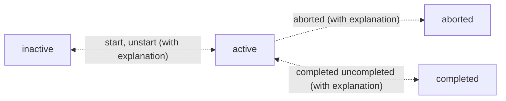

# Life Helper SolidJS Application

## Notes

- About time 3:45 into the `Register & Install a Service Worker` subsection of the `Service Worker Project` section of the `Exploring Service Workers` [tutorial](https://frontendmasters.com/courses/service-workers/register-install-a-service-worker/) by Kyle Simpson he explains the `file system scope` of a service worker and how he obfuscates the physical location with a server route. It makes me think that there is a way in Vite that I can accomplish the same thing.
- Do not put an ampersand, `&`, in the name of a folder anywhere in the path within which `vite` is being used. It results in an error thrown by node.js saying that it cannot find vite. I did `NOT` try an uninstall and reinstall of `vite` to see if that may also be a solution.
- I think I used [this](https://redketchup.io/favicon-generator) site to create the icon.
- See [this](https://serviceworke.rs/) resource for all sorts of service worker implementations. Note that the UI design is a little weird and that the code associated with each of the `recipes` is accessible through the tiny links in the top right-hand corner. Also, if you click a code link that does not have code associated with it the interface does not inform you of that it just navigates to the page without the links which is really weird.

## Basics

- To start this application run the following command.
  ```bash
  npm run dev
  ```
- This application uses the `Express Server` application as the backend for data access and the domain, that is the IP address and port, are in `GlobalStateProvider.jsx` in this application. Whenever the Express Server is launched make sure that the domain IP address and port it is listening on are accurately reflected in GlobalStateProvider.jsx

## Vite Build and Preview

- In both cases I need to manually put a copy of service_worker.js in the dist directory.
- There should be some way to automate this.

## Application Behavior

- a task is `active` if it is started but not completed.
- a task is `inactive` if it is not `active, completed or aborted`.`
- A task cen be deleted only if it is not active, that is, has been started.
- A task can be aborted only if it has been started and not completed and the user provides an explanation.
- A task can be started but it can only be `un-started` if the task is not completed and if the user provides an explanation.
- A task can be can only be `un-completed` if the user provides an explanation.
- A task can be paused only if it has been started and not completed.



## Enable https self-signed SSL certificates:

- Service workers will only work with https.
- I used the plugin vite-plugin-mkcert to enable https in Vite which is running the front-end web server. That is, no actual certificate needs to be created as this plugin handles all of that.
- I used `mkcert to create root certificate authority certificates` for both the windows laptop and the linux laptop. On the windows machine in the certificate manager I believe the two important certificates are the ones that `begin with mkcert`. I then placed this SSL certificate in the certificates in the `Trusted Root Certification Authorities` node in the Microsoft Management Console accessible accessible using the `mmc` command. I saved a view in mmc called "Console1.mmc" to more easily navigate to the list of certificates where this certificate is stored. There is another on with the name DESKTOP-4QSML4N\tomla@DESKTOP-4QSML4N (Thomas Langan) but I don't think that is directly relevant.

## Service Workers:

- Remember that if you go to the Application tab of Chrome Dev Tools you can see the service worker associated with that tab. You can also do things like `Stop` it and `Unregister` it. Also available at the bottom of the service workers panel is a link to `See all registrations`.
- To reset the permissions for the service worker do the following:
  - Open the browser settings
  - Click on `Privacy and Security`
  - Click on `Site Settings`
  - Scroll to the appropriate URL, for example, https://127.0.0.1:3000 or https://localhost:3000 or both
  - Click the right-pointing triangle
  - Change Notifications from "Allow" to "Ask"
- You do not need to reset the permissions to release a new version of a service worker. You would do so to test the web push subscription process.
