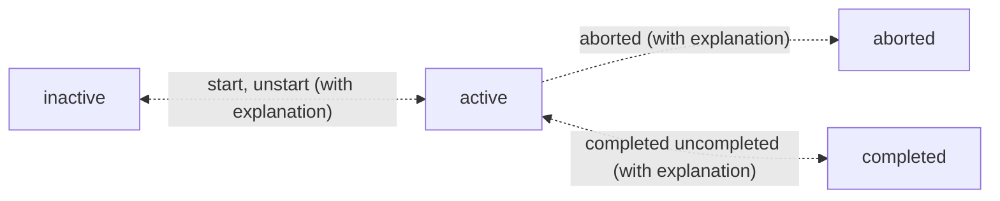

# Life Helper SolidJS Application

## Notes

1. Do not put an ampersand, `&`, in the name of a folder anywhere in the path within which `vite` is being used. It results in an error thrown by node.js saying that it cannot find vite. I did `NOT` try an uninstall and reinstall of `vite` to see if that may also be a solution.

## Basics

1. To start this application run the following command.
   ```
   npm run dev
   ```
1. This application uses the `Express Server` application as the backend. It assumes it is listening on port 3001.
1. Note that it is important that this application starts on port 3000 as the server overrides `CORS` for requests coming from this port.

## Search Resources

1. See VSCode stuff located in D:\Computer Science\NEED TO REVIEW\JavaScript\Orchestrate Asynchronicity
1. See `Netflix Search Box` section of D:\Computer Science\Tutorials\Front End Masters\Abandoned\Frameworks\Asynchronous Programming with RxJS\Asynchronous Programming in JavaScript.docx.
1. See VSCode stuff located in D:\Computer Science\NEED TO REVIEW\JavaScript\Observables 1
1. See VSCode stuff located in D:\Computer Science\Tutorials\Front End Masters\Abandoned\JavaScript\Rethinking Asynchronous JavaScript. Specifically, `Exercises\Ex6`

## Application Behavior

1. a task is `active` if it is started but not completed.
2. a task is `inactive` if it is not `active, completed or aborted`.`
3. A task cen be deleted only if it is not active, that is, has been started.
4. A task can be aborted only if it has been started and not completed and the user provides an explanation.
5. A task can be started but it can only be `un-started` if the task is not completed and if the user provides an explanation.
6. A task can be can only be `un-completed` if the user provides an explanation.
7. A task can be paused only if it has been started and not completed.



## Enable https in Vite:

1. The use @vitejs/plugin-basic-ssl to enable https did not work; however, mkcert did. Using it resulted in the following SSL certificate with the "mkcert DESKTOP-..." issued by value in the certificates in the `Trusted Root Certification Authorities` in the Microsoft Management Console accessible using the `mmc` command.

## Self-Signed Certificates and Service Workers

1. [This](https://windowsreport.com/chrome-ignore-certificate-errors/) resource speaks to the error that occurs when trying to register a service worker with a self-signed SSL certificate. In my case the specific error is `Uncaught (in promise) DOMException: Failed to register a ServiceWorker for scope ('https://localhost:3000/src/') with script ('https://localhost:3000/src/service.js'): An SSL certificate error occurred when fetching the script.`
1. The above did not work so I am trying [this](https://thriveread.com/mkcert-localhost-ssl-certificates/). Note, to run these commands I opened git bash as administrator and navigated to the location `D:\Computer Science\Original Applications\SSL certificate for localhost` to run the commands.

## Multi User Considerations

1. For now I am going to gloss over multi-user considerations like preventing two users from starting the same task or pushing changes out from the database as they get posted so that all users are aware.

```

```
