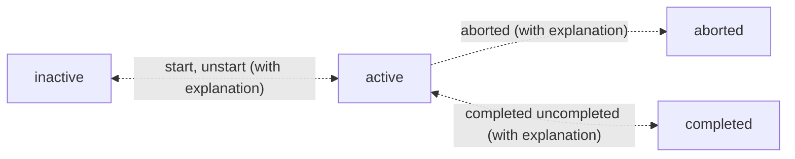

# Life Helper SolidJS Application

## Notes

1. About time 3:45 into the `Register & Install a Service Worker` subsection of the `Service Worker Project` section of the `Exploring Service Workers` [tutorial](https://frontendmasters.com/courses/service-workers/register-install-a-service-worker/) by Kyle Simpson he explains the `file system scope` of a service worker and how he obfuscates the physical location with a server route. It makes me think that there is a way in Vite that I can accomplish the same thing.
1. Do not put an ampersand, `&`, in the name of a folder anywhere in the path within which `vite` is being used. It results in an error thrown by node.js saying that it cannot find vite. I did `NOT` try an uninstall and reinstall of `vite` to see if that may also be a solution.

## TODOs 1/15/2024

<span id="service-worker-in-root"></span>

1. **When I moved server.js to the root, I was able to send messages to the client, that is, the web page itself.**
2. **When I change the name of the service worker file the behavior is the same as changing its contents.**
3. **Without skipWaiting called in the install event, the new service worker is not used until the page is closed and reopened.**
4. **Enable service worker changes to activate without closing and reopening the app. To do this most effectively I needed to both issue a `skipWaiting()` in the install event as well as a `event.waitUntil(clients.claim())` in the activation event.**
5. Log service worker changes and retiring previous service worker DB rows. Perhaps I should create a new entity web_push_subscription_version which maintains a history of service workers that all use the same capability url.s
6. I should create a route using solidJS to give the appearance that the service worker file is at the root and move it to a more logical place in the file system. See <a href="#service-worker-in-root">item number 1</a> above

## Basics

1. To start this application run the following command.
   ```
   npm run dev
   ```
1. This application uses the `Express Server` application as the backend. It assumes it is listening on port 3001.
1. Note that it is important that this application starts on port 3000 as the server overrides `CORS` for requests coming from this port.

## Search Resources

1. See VSCode stuff located in D:\Computer Science\NEED TO REVIEW\JavaScript\Orchestrate Asynchronicity
1. See `Netflix Search Box` section of D:\Computer Science\Tutorials\Front End Masters\Abandoned\Frameworks\Asynchronous Programming with RxJS\Asynchronous Programming in JavaScript.docx.
1. See VSCode stuff located in D:\Computer Science\NEED TO REVIEW\JavaScript\Observables 1
1. See VSCode stuff located in D:\Computer Science\Tutorials\Front End Masters\Abandoned\JavaScript\Rethinking Asynchronous JavaScript. Specifically, `Exercises\Ex6`

## Application Behavior

1. a task is `active` if it is started but not completed.
2. a task is `inactive` if it is not `active, completed or aborted`.`
3. A task cen be deleted only if it is not active, that is, has been started.
4. A task can be aborted only if it has been started and not completed and the user provides an explanation.
5. A task can be started but it can only be `un-started` if the task is not completed and if the user provides an explanation.
6. A task can be can only be `un-completed` if the user provides an explanation.
7. A task can be paused only if it has been started and not completed.



## Enable https in Vite:

1. The use @vitejs/plugin-basic-ssl to enable https did not work; however, mkcert did. Using it resulted in the following SSL certificate with the "mkcert DESKTOP-..." issued by value in the certificates in the `Trusted Root Certification Authorities` in the Microsoft Management Console accessible using the `mmc` command.

## Self-Signed Certificates and Service Workers

1. See [this](https://serviceworke.rs/) resource for all sorts of service worker implementations. Note that the UI design is a little weird and that the code associated with each of the `recipes` is accessible through the tiny links in the top right-hand corner. Also, if you click a code link that does not have code associated with it the interface does not inform you of that it just navigates to the page without the links which is really weird.

## Multi User Considerations

### Working On Line

1. Prevent two users from starting the same task.

### Working Off Line

1. Do not allow a user to start a task but do allow them to work on it and complete it.
